# Digital Footprint – Writeup
# Welcome!

- YØ! I tackled **Digital Footprint** on TryHackMe, which was a challenge focused on **OSINT**. This room is about investigating a company called ACME Jet Solutions through analyzing images, metadata, and archived web content to uncover their real history.

In this writeup, I'll show you my investigative process, the tools I used for metadata analysis and web archaeology, and how I tracked down the truth about this mysterious company!

<p align="center">
  
</p>

---

## Task 1 – Photo Location Analysis

**Description:**
An ACME Jet Solutions employee uploaded a photo of a residential property believed to be linked to ACME Jet's early operations. Can you figure out where the picture was taken to confirm or debunk the rumour?

**Flag format:** `THM{City}`

**Question:** In which city was the photo taken?

### Investigation

First, I examined the photo provided. Right away, I spotted something interesting in the image: text saying **"The Rectory"**.


My first instinct was to search for "The Rectory" on Google. I found The Rectory Hotel in the United Kingdom.

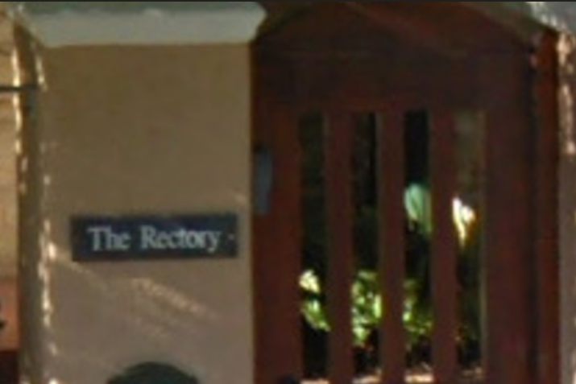

However, submitting the UK city as the answer didn't work. Time to do what I should have done first: **check the metadata!**

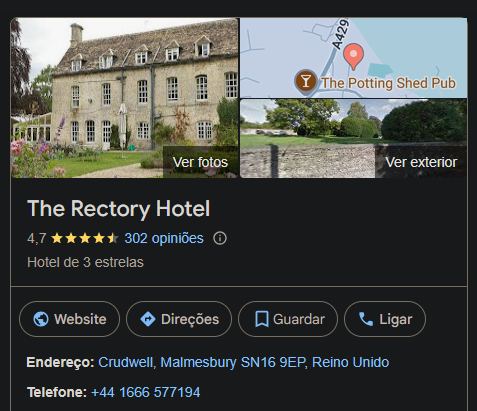

Perfect! I found GPS coordinates in the metadata:

```
26 deg 12' 14.76", 28 deg 2' 50.28"
```

Throwing these coordinates into Google Maps revealed the actual location...

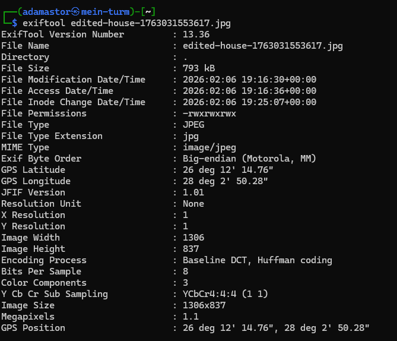

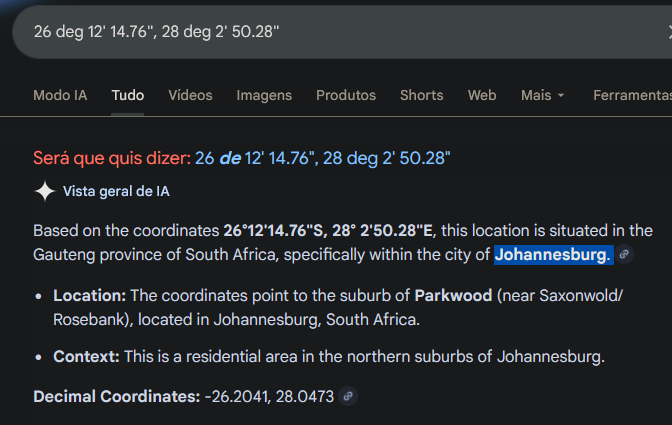

**Answer:** `THM{Johannesburg}`

---

## Task 2 – Website Archaeological Investigation

**Description:**
ACME Jet Solutions (warc-acme.com/jef/) is all over social media claiming they were founded in 2025 and that they're the fastest-growing data company in Africa. But something doesn't add up—one of their ex-employees ensures you that the company existed long before that.

Your job as an OSINT investigator is to verify their founding date using only public information.

**Flag Format:** `THM{YYYYMMDDHHMMSS}`

**Question:** When was the website first published on the internet?

### Investigation

Visiting `warc-acme.com/jef/` directly didn't work. The page just doesn't load. But wait... when investigating the history of websites, there's a perfect tool for this: **Wayback Machine!**

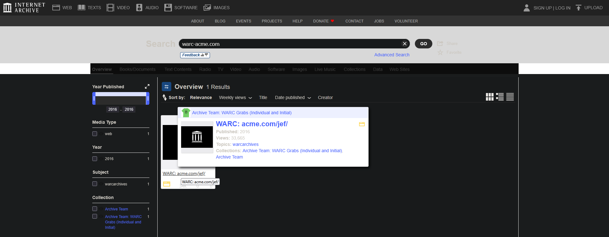

Well, well, well... look who was already on the internet back in **2016!**

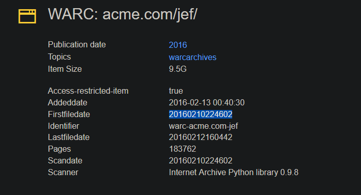

The Wayback Machine shows the exact timestamp when this website was first archived. We can see the **FirstFileDate** which gives us our answer:

**Answer:** `THM{20160210224602}`

So much for being founded in 2025! The company's web presence dates back to February 10, 2016, at 22:46:02.

---

## Task 3 – Landmark Identification

**Description:**
Further investigation uncovers another image believed to be connected to the company's international expansion.

Research reveals that to the right of the iconic landmark is a building that played a big role in the fight for independence of a particular country. Signs on the external wall provide the name of the building.

Submit the name of the building translated into English as the flag.

**Flag format:** `THM{Landmark}`

**Question:** What is the landmark?

### Investigation

Looking at the provided image, I noticed something interesting on one of the flags on the right side—text that appeared to say **"Dublinone"**.


To be fair, I searched for **"Dublin big pole landmark"** on Google.

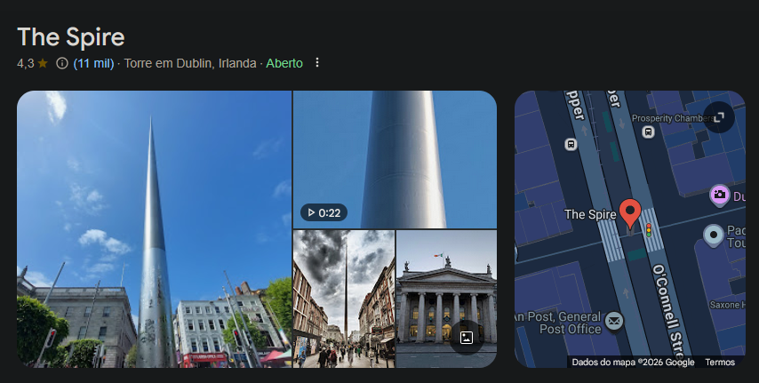

 The iconic landmark is the **Spire of Dublin**, and the building to its right with historical significance is the **General Post Office**, according to Google.

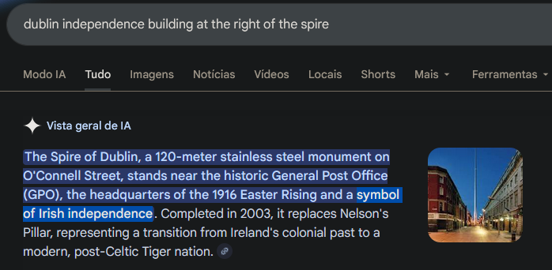

**Answer:** `THM{General Post Office}`

---

## Task 4 – The Leaked Document

**Description:**
After uncovering ACME Jet Solutions' origins and tracing their online presence through archived websites and international landmarks, investigators believe that an internal document was accidentally leaked by one of the company's developers.

The document may contain crucial information about the individual responsible for maintaining their systems.

**Question:** What is the final flag?

### Investigation

I received an ODT (Open Document Text) file. **Check the metadata!**

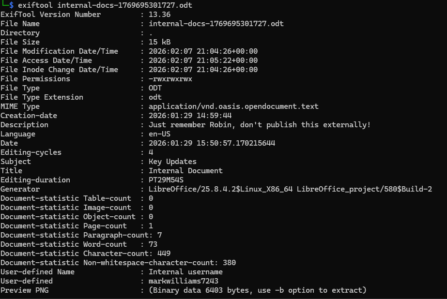

Perfect! The metadata revealed some interesting information:
- **Username:** `markwilliams7243`
- **Comment:** "Just remember Robin, don't publish this externally!"

Well... looks like that didn't work out, Mark! The document was definitely published externally.

Out of curiosity, I opened the document to see what it contained:

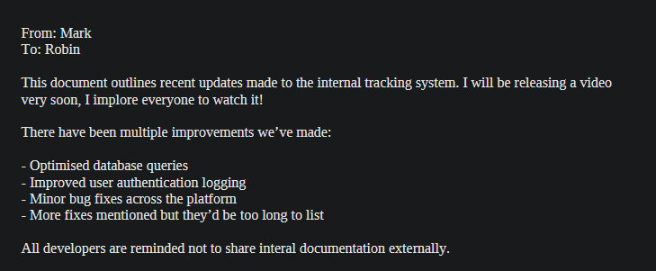

The document mentioned: **"I will be releasing a video soon"**. This gave me an idea. Since we have a username and he talked about a video, let's check **YouTube!**

I searched for `markwilliams7243` and filtered by **"Channels only"**. There's our friend!

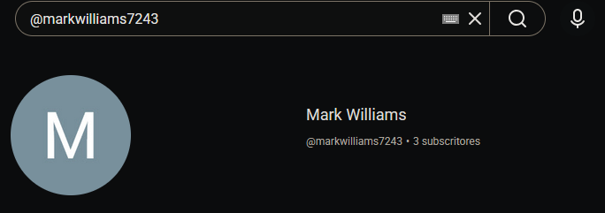

Accessing the channel, I found that the community post that was supposed to be internal was actually public... Sorry, Mark!

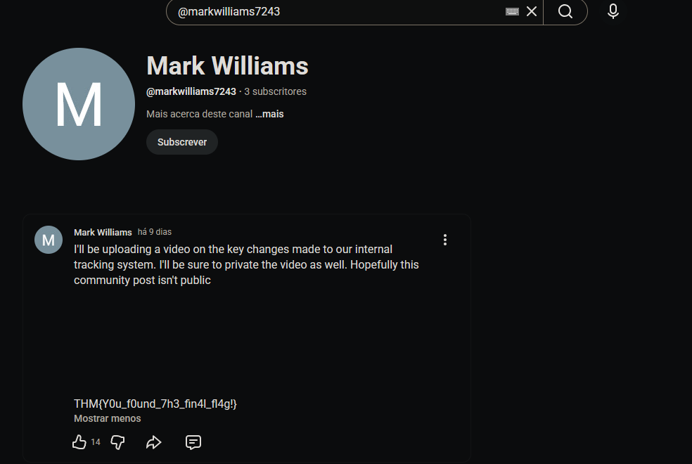

**Answer:** `THM{Y0u_f0und_7h3_fin4l_fl4g!}`

---

# Goodbye!

That's it for my writeup! Hope this helps you on your OSINT journey. Until next time and keep hacking!

<p align="center">
  
</p>
