# Operation Slither – Writeup
# Welcome!

- YØ! I tackled **Operation Slither** on TryHackMe, which was a challenge focused on **OSINT**. This room involves tracking down operators of a hacker group through their social media presence, finding flags hidden in various platforms, and uncovering infrastructure details.

In this writeup, I'll show you my process, the platforms I checked, and how I tracked down each operator and their leaked information. This is all about digital footprints and careful reconnaissance!

<p align="center">
  
</p>

---

## Task 1 – The Leader

<p align="center">
  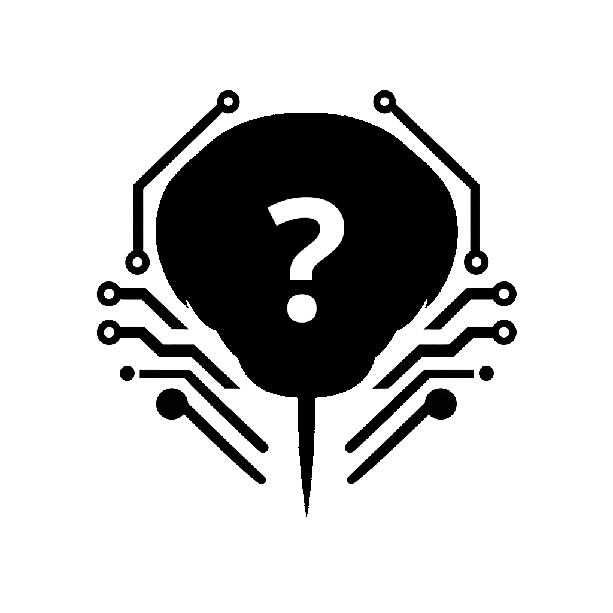
</p>

**Description:**
We got access to a hacker forum and found info about our company on sale! All the info we have is in this post. Find any information related to the leader of the Sneaky Viper group.

**Forum Post:**
```
Full user database TryTelecomMe on sale!!!

As part of Operation Slither, we've been hiding for weeks in their network 
and have now started to exfiltrate information. 
This is just the beginning. We'll be releasing more data soon. Stay tuned!

@v3n0mbyt3_
```

### Reconnaissance Guide
- Begin with the provided username and perform a broad search across common social platforms.
- Correlate discovered profiles to confirm ownership and authenticity.
- Review interactions, posts, and replies for potential leads.

### Investigation

As the guide said, I started checking common social platforms. On Facebook, I found nothing. I got lucky on Instagram!

<p align="center">
  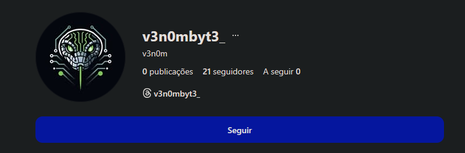
</p>

I found the user `@v3n0mbyt3_` on Instagram. Although it's tempting, the answer is not Instagram.

The user has a Threads account linked to the Instagram account. If we check it, we find our friend here!

<p align="center">
  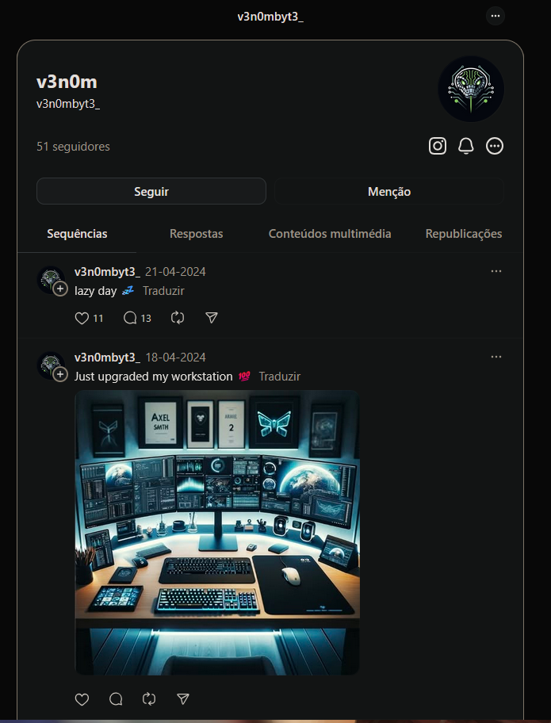
</p>

**Question 1:** Aside from Twitter / X, what other platform is used by v3n0mbyt3_? Answer in lowercase.

**Answer:** `threads`

### Finding the Flag

It's a normal account, we can see the followers but first let's check the posts.

<p align="center">
  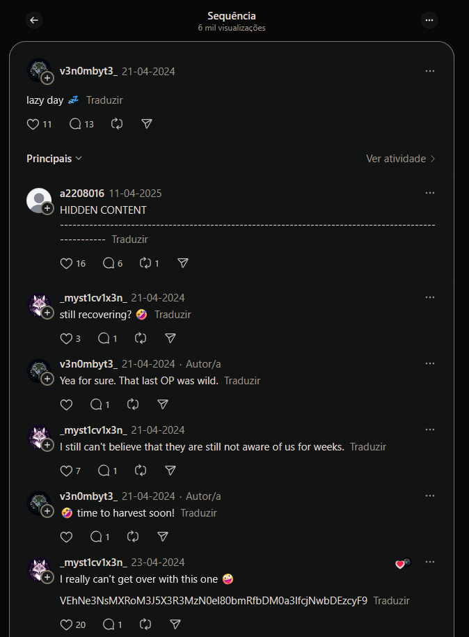
</p>

They mention a lot of things, it seems they're talking about some invasion, probably the server invasion mentioned above.

At the bottom we have a string:
```
VEhNe3NsMXRoM3J5X3R3MzN0el80bmRfbDM0a3lfcjNwbDEzcyF9
```

To be honest, I just used the "Magic" option in CyberChef and it came out as Base64, so here's the flag:

**Question 2:** What is the value of the flag?

**Answer:** `THM{sl1th3ry_tw33tz_4nd_l34ky_r3pl13s!}`

<p align="center">
  
</p>

---

## Task 2 – The Sidekick

<p align="center">
  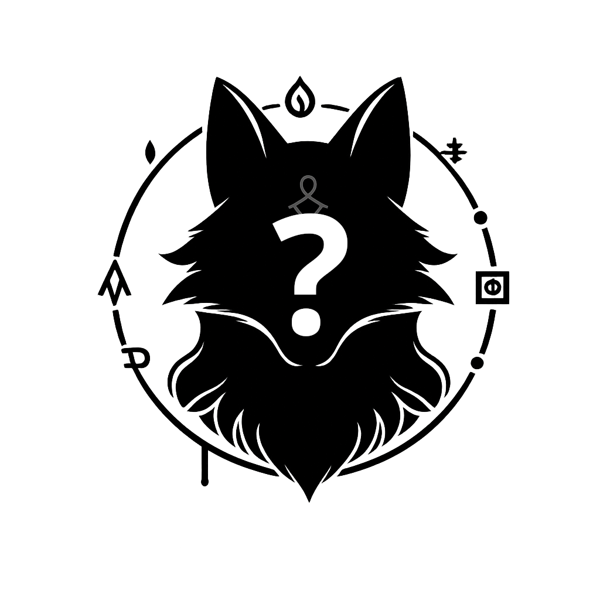
</p>

**Description:**
A second message has been made public! Our account in their forum was deleted, so we couldn't get the operator's handle this time. Follow the crumbs from the first task and hunt any information related to the second operator of the group.

**Forum Post:**
```
60GB of data owned by TryTelecomMe is now up for bidding!

Number of users: 64500000 
Accepting all types of crypto
For takers, send your bid on Threads via this handle:

HIDDEN CONTENT 
----------------------------------------------------------------------------------------------------- 
You must register or log in to view this content
```

### Reconnaissance Guide
- Use related usernames or connections identified in earlier steps to expand reconnaissance.
- Enumerate additional platforms for linked accounts and shared content.
- Follow media or resource references across platforms to trace information flow.

### Investigation

The "hidden content" looked similar to what we saw on Threads. Opening it, we see that a strange user commented on it and we can also see people bidding.

In the previous post, we can see that a “mystic” user is talking to our first user, as if they know each other.

<p align="center">
  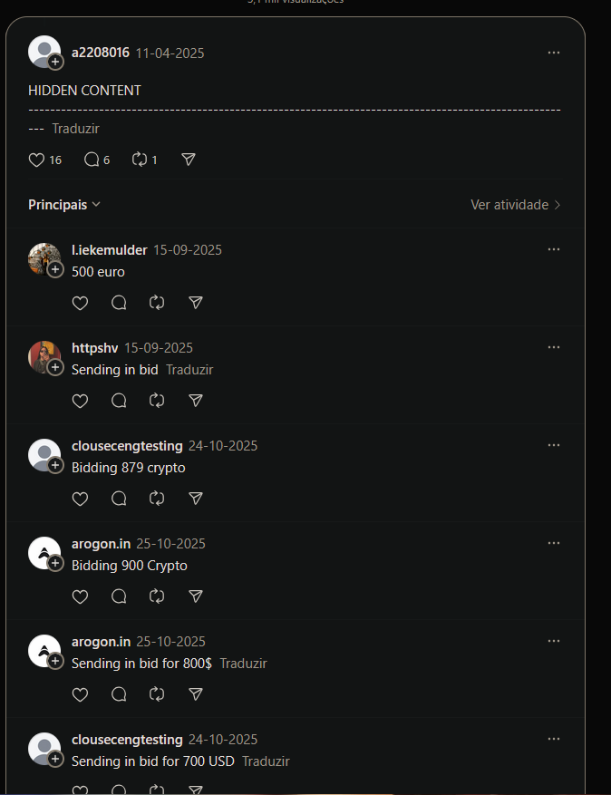
</p>

**Question 1:** What is the username of the second operator talking to v3n0mbyt3 from the previous platform?

**Answer:** `_myst1cv1x3n_`

### Analyzing the Second Operator

Let's analyze this user. Threads doesn't seem to have anything important, let's check Instagram.

<p align="center">
  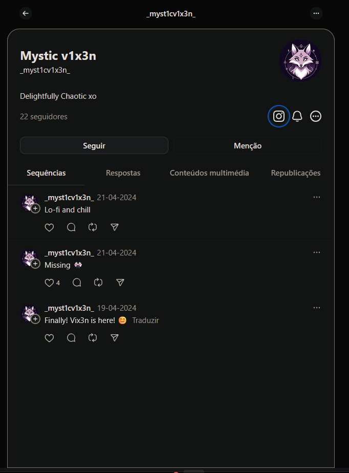
</p>

Perfect! Let's explore the posts.

<p align="center">
  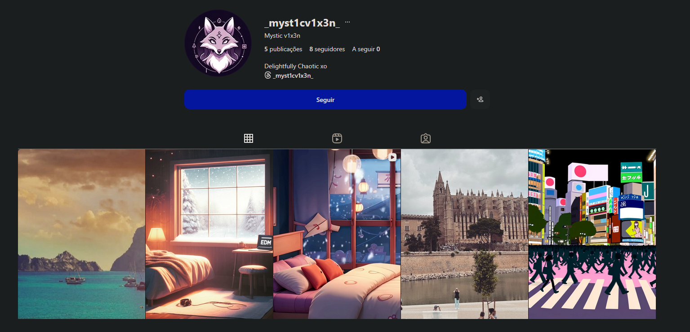
</p>

Ok, this post has a link to SoundCloud!

<p align="center">
  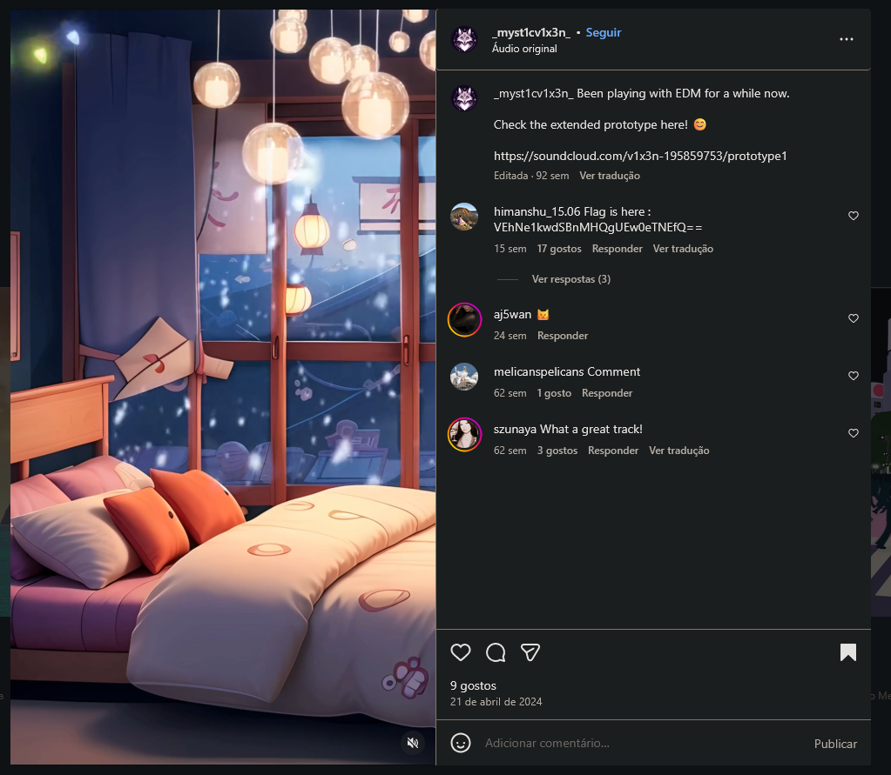
</p>

There’s someone in the comments who ate palhacitos. I don’t know if it’s a spoiler, so I won’t check it.

Following the SoundCloud link, we come across this. Let's analyze the profile.

<p align="center">
  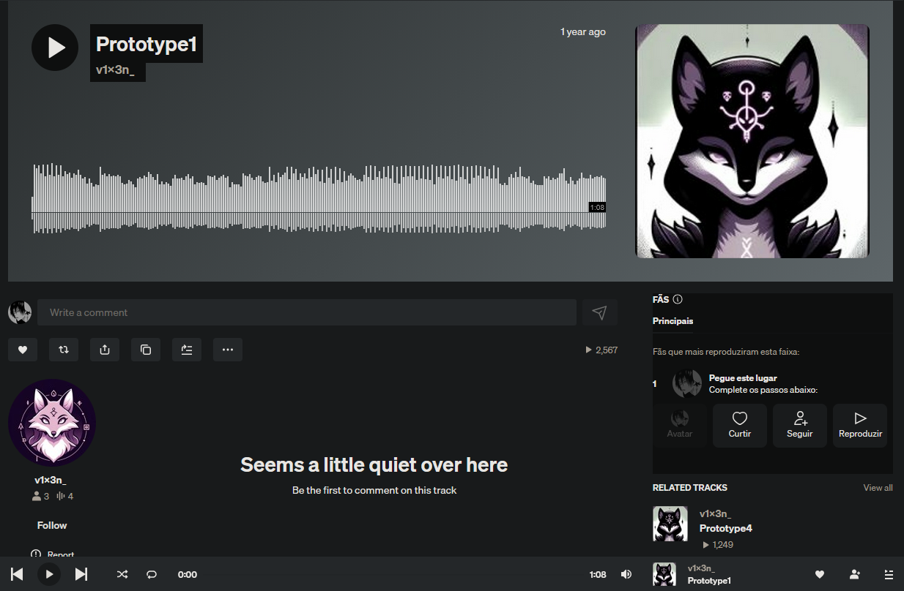
</p>

This track called "Prototype 2" shows a small meeting they had, weird! Let's listen to the rest of the meeting carefully.

While listening to the meeting, I noticed that one of the audio's likes was from a person with an AI-generated image and the name followed the pattern of the others. Could be another player like me or possibly the next step, let's investigate.

### Finding the Flag

We found the flag as a comment on this "Prototype 2":
```
VEhNe3MwY20xbnRfMDBwczNjX2Yxbmczcl9tMXNjbDFja30=
```

<p align="center">
  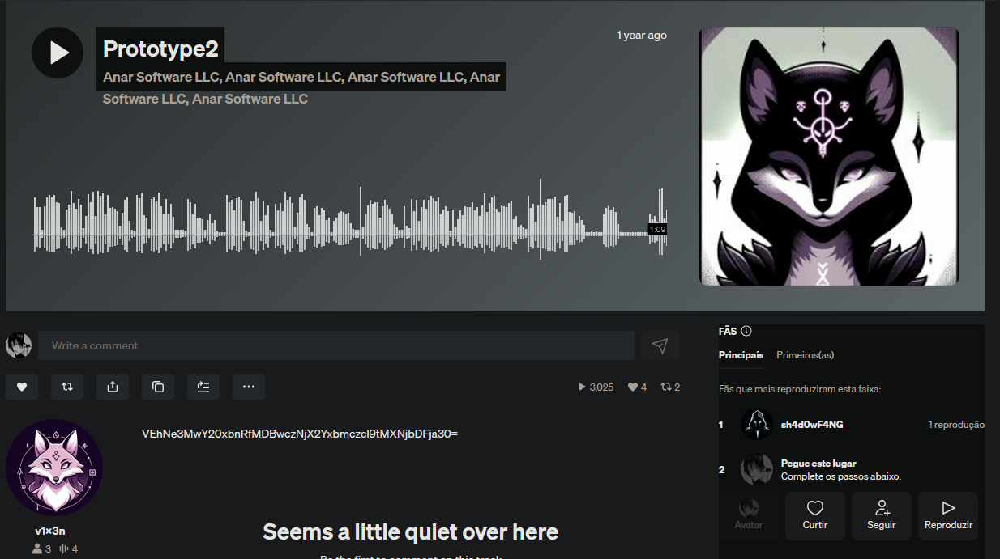
</p>

Decoding the string in CyberChef, we get the flag:

<p align="center">
  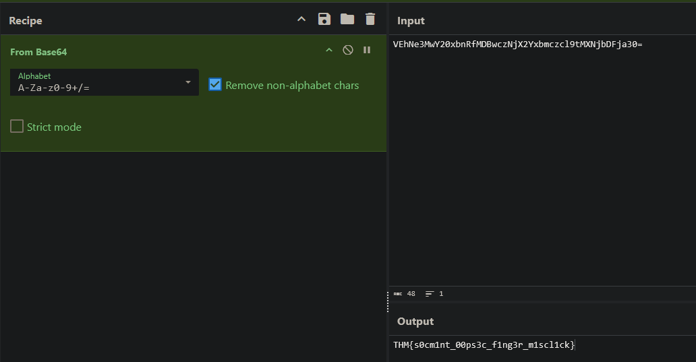
</p>

**Question 2:** What is the value of the flag?

**Answer:** `THM{s0cm1nt_00ps3c_f1ng3r_m1scl1ck}`

<p align="center">
  
</p>

---

## Task 3 – The Third Operator

<p align="center">
  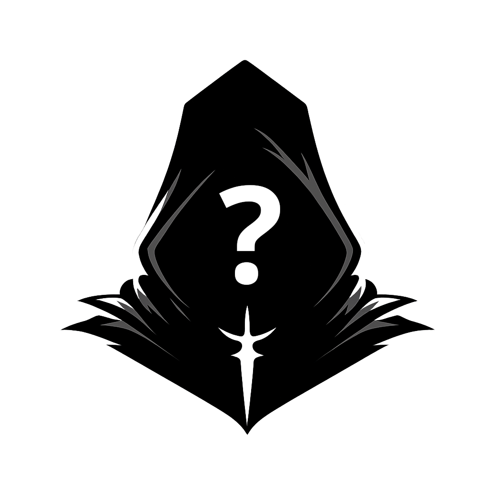
</p>

**Description:**
A new post is up. Hunt the third operator using past discoveries and find any details related to the infrastructure used for the attack.

**Forum Post:**
```
FOR SALE

Advanced automation scripts for phishing and initial access!

Inclusions:
- Terraform scripts for a resilient phishing infrastructure 
- Updated Google Phishlet (evilginx v3.0)
- GoPhish automation scripts
- Google MFA bypass script
- Google account enumerator
- Automated Google brute-forcing script
- Cobalt Strike aggressor scripts
- SentinelOne, CrowdStrike, Cortex XDR bypass payloads

PRICE: $1500
Accepting all types of crypto
Contact me on REDACTED@protonmail.com 
```

### Reconnaissance Guide
- Identify secondary accounts through visible interactions (likes, follows, collaborations).
- Extend reconnaissance into developer or technical platforms associated with the identity.
- Analyse activity history (such as repositories or commits) for embedded information.

### Investigation

Ok, I can now confirm it was the next step! The user I had seen before with the AI-generated image was indeed relevant.

<p align="center">
  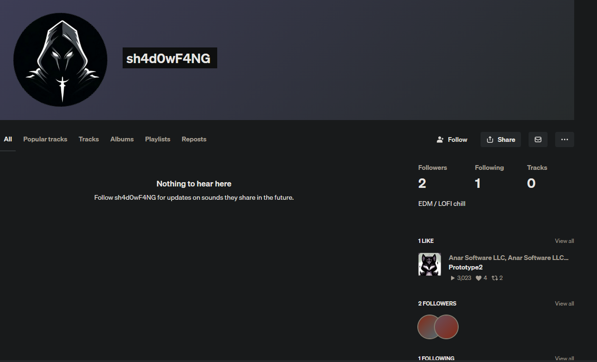
</p>

**Question 1:** What is the handle of the third operator?

**Answer:** `sh4d0wF4NG`

Well, as I said, I went searching and actually, I found the lil bro on GitHub!

<p align="center">
  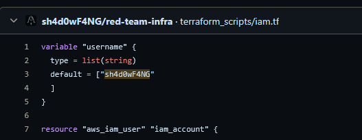
</p>

<p align="center">
  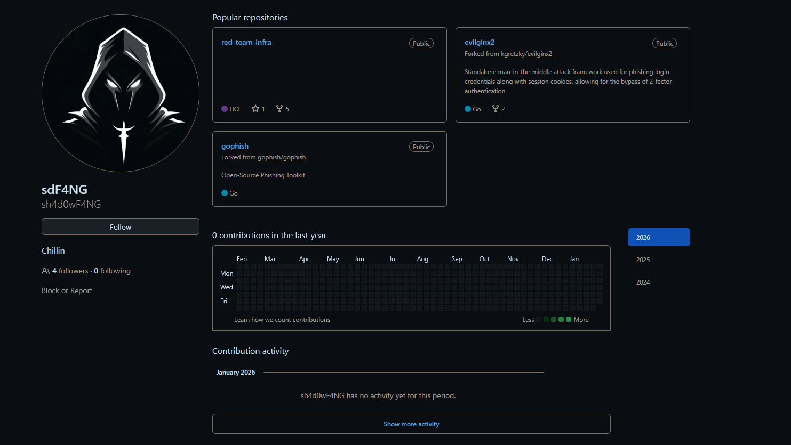
</p>

**Question 2:** What other platform does the third operator use? Answer in lowercase.

**Answer:** `github`

### Finding the Flag

Now, let's go after the flag. Ok, this will probably sound super stupid, but...

He has 3 repos, 2 of them are forks, one is original. If we check his commit history, he might have left some sensitive info.

<p align="center">
  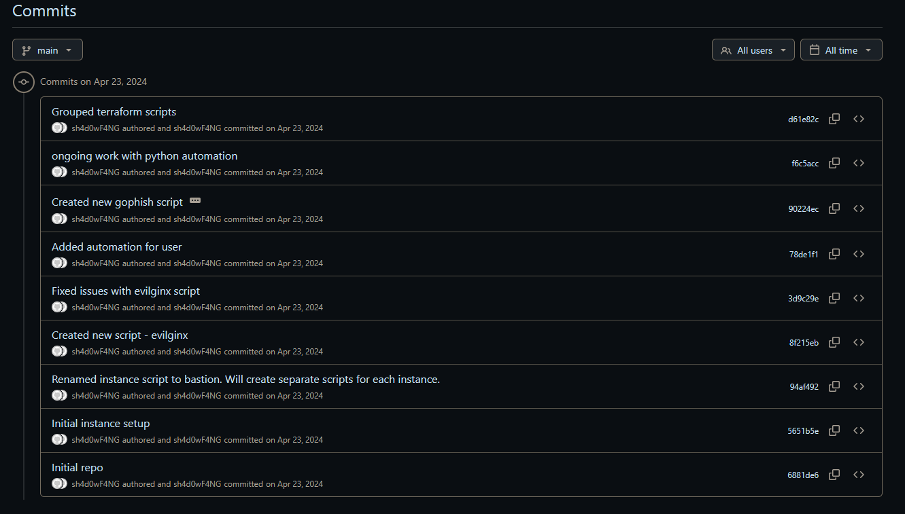
</p>

The most promising commit seems to be "added automation for user" since automating a user usually refers to logins or actions and that normally requires a password.

Inside this commit, we can see the shadow password with the value encoded in Base64.

<p align="center">
  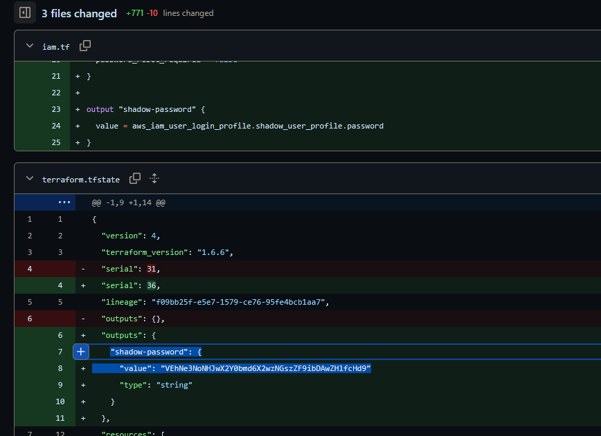
</p>

Back to CyberChef and... bingo!

<p align="center">
  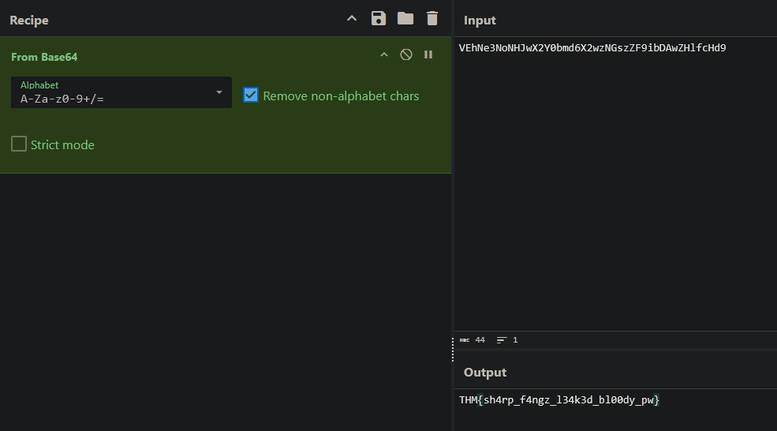
</p>

**Question 3:** What is the value of the flag?

**Answer:** `THM{sh4rp_f4ngz_l34k3d_bl00dy_pw}`

<p align="center">
  
</p>

---

## Final Thoughts

**Remember kids! Think before you commit!**

<p align="center">
  
</p>

# Goodbye!

And that's it! This challenge was funnier than I expected.

Until next time and keep hacking!

<p align="center">
  
</p
